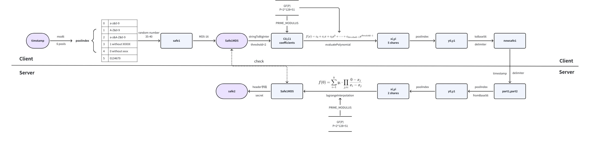

# SecretSharing-Signature
一个基于秘密分享（纵向联邦学习）的网关验签算法实践。A practical gateway signature verification algorithm based on secret sharing (vertical federated learning).

**注：这是对于某已有网关验签算法的优化，不涉及任何企业真实场景实现**

## 优化背景

- 客户端未加固版本可能泄露safe1、safe2生成逻辑
- 服务端未对safe1进行正确性校验，也无法校验safe1的真实性
- 服务端仅校验safe2，但safe2的生成逻辑可能被猜出（遍历插入safe1）

## 设计需求

- 希望能加入对safe1的校验
- 希望safe1是唯一的、不可被重复利用的
- 同一个请求下同一个timestamp只能对应唯一的safe2
- 希望即使知道了safe2的生成逻辑，也无法“计算”safe2
- 希望即使知道了safe1的生成源码，也无法“计算”safe1
- 不能够明显增加计算延迟

## 仍有缺陷

- 如果客户端仍能被hook，验签无效（只要替换验签入参就好）
- 如果被知道客户端源码，是可以生成一套符合规则的safe1、safe2，完全模拟请求，通过服务端校验

## 主要思路

**在保留大部分原始客户端验签的逻辑下，通过某种手段，不暴露真实safe1，但服务端又能从原始请求中得到真实safe1，并通过计算safe2的正确与真实性，侧面验证safe1的正确与真实性**

1. safe1按照原来的逻辑生成（6个随机池，35-40位随机位的字串），取MD5-16（Safe1MD5），作为safe2计算参数
2. Safe1MD5被拆分成5个随机大整型分片，取其中2个分片，通过56进制压缩后拼接成请求包中的safe1（newSafe1）
3. 网关收到请求后，先将newSafe1拆成两个部分，通过56进制解压成原始的2个大整型分片，通过这两个分片还原成Safe1MD5
4. Safe1MD5作为safe2计算参数，在网关计算与请求包内的是否相同

### 流程图



### 数学解释

由于数学解释实在太复杂，估计要回去看看论文才能懂，这里只讲这些数学知识是在算法中做什么作用的：

#### **[有限域（素数域）](https://zh.wikipedia.org/wiki/有限域)**：

1. 实际上是一个环，我设定的最大值是 $$2^{128}+51$$（ $$GF(P)$$），39位的大整数，因为这个数是与MD5-16生成的最大可能值（“zzzzzzzzzzzzzzzz”）转化为的大整型数同位数但更大的素数，一定程度上能使newsafe1的长度缩短一些；
2. 如果不使用有限域，在大整型的加乘运算中会产生根本无法处理的大数字
3. 值得注意的是，在有限域中的计算（加减乘除）后，得到的结果其实是落在一个类里（如在 $$GF(5)$$中，因为 $$3mod5=3,8mod5=3$$，都落在 $$-\atop 3$$中），此时它本身的数值意义被淡化

#### **[多项式](https://zh.wikipedia.org/wiki/多項式)**：

$$f(x)=c_0+c_1x+c_2x^2+…+c_{threshold-1}x^{threshold-1}$$

1. 我们把上面这个式子取 $$x=0$$，此时 $$f(0)=c_0$$，我们让多项式中的常数项 $$c_0$$值为Safe1MD5的大整型数，加入coefficients（多项式系数）数组；
2. 当需要恢复分片数（threshold）为t时，coefficients内含有t个元素，除第一项为Safe1MD5的大整型数，余下 $$c_1…c_{t-1}$$为有限域内随机的大整数；
3. 当需要分片总数（numShares）为n时，将 $$x=1…x=n$$代入多项式，得到n组分片shares，其中shares为二维数组：

$$[[1,c_0+c_1],[2,c_0+2c_1+4c_2],…,[n,\sum_{t=1}^t c_{t-_1}n^{t-1}]]$$

#### **[拉格朗日插值法](https://zh.wikipedia.org/wiki/拉格朗日插值法)**：

$$P(x)=\sum_{i=0}^ny_il_i(x)=y_0l_0(x)+y_1l_1(x)+…+y_nl_n(x)$$

1. 我们假设有一个多项式如上，我们以对 $$ (x1,y1),(x2,y2),(x3,y3)$$三个点插值为例：
   1. 当我们代入 $$x_1$$到函数 $$P(x)$$时， $$l_1(x_1)=1,l_2(x_1)=0,l_3(x_1)=0$$，这使得 $$P(x_1)=y_1$$
   2. 当我们代入 $$x_2$$到函数 $$P(x)$$时， $$l_1(x_2)=0,l_2(x_2)=1,l_3(x_2)=0$$，这使得 $$P(x_2)=y_2$$
   3. 当我们代入 $$x_3$$到函数 $$P(x)$$时， $$l_1(x_3)=0,l_2(x_3)=0,l_3(x_3)=1$$，这使得 $$P(x_3)=y_3$$
2. 什么样的 $$ l(x) $$满足这样的性质？
   1. 对于 $$l_1(x)$$来说，不难想到 $$l_1(x)=(x−x_2)(x−x_3) $$满足代入 $$x_2,x_3$$输出0的性质
   2. 此时，如果代入 $$x_1$$，容易注意到如果修改 $$ l_1(x)$$为 $$l_1(x)=\frac{(x−x_2)(x−x_3)}{(x_1−x_2)(x_1−x_3)}$$，则 $$l_1(x_1)=1 $$性质也就被满足了
3. 基于这个例子，我们可以推广 $$ l_i(x) $$的表达式
   1. 假设我们现在有n个点需要插值， $$(x_1,y_1),(x_2,y_2),(x_3,y_3)....(x_n,y_n)$$
   2. 对于 $$l_i(x)$$ ,其需要满足 $$l_i(x_i)=1$$，代入其它值为0
   3. 显然： $$l_i(x)=\frac{(x-x_1)(x-x_2)…(x-x_n)}{(x_i-x_1)(x_i-x_2)…(x_i-x_n)}=\frac{\prod_{j=1,j\not=i}^n(x-x_j)}{\prod_{j=1,j\not=i}^n(x_i-x_j)}$$

### 算法可行性解释

在平面上，任意给出 $$n+1$$个点 $$(x_0,y_0),(x_1,y_1)...(x_n,y_n)$$，在区间 $$[a,b]$$上求一个多项式 $$P(x)$$，使其满足 $$P(x_i)=y_i , i=0,1,2.....n$$，我们可以将其写成 $$n$$阶线性方程组的形式，当 $$n+1$$个点互不相同，满足 $$\prod_{0≤i时，该线性方程组有唯一解：

$$a_0+a_1x_0+a_2x_0^2+…+a_nx_0^n=y_0$$

$$…$$

$$a_0+a_1x_n+a_2x_n^2+…+a_nx_0^n=y_n$$

从多项式和拉格朗日插值法的推导，我们可以知道：一个多项式可以被表示成

$$P(x)=\sum_{i=0}^ny_il_i(x)=\sum_{i=0}^ny_i\frac{\prod_{j=0,j\not=i}^n(x-x_j)}{\prod_{j=0,j\not=i}^n(x_i-x_j)}$$

则 $$P(0)=f(0)=c_0=\sum_{i=0}^ny_i\frac{\prod_{j=0,j\not=i}^n(0-x_j)}{\prod_{j=0,j\not=i}^n(x_i-x_j)}$$，可被计算还原出Safe1MD5的大整型数

可以通过小数还原计算一下，如：

$$PRIMEMODULUS=11，GF(11)，numShares=5，threshold=3$$

$$BigInteger(Safe1MD5)=10，coefficients=[10,7,4]$$

$$shares:[[1,10], [2,7], [3,1], [4,3], [5,2]]$$

$$i=0, secret=10$$

$$i=1,secret=9$$

$$i=2 secret=10=BigInteger(Safe1MD5)$$

### safe1随机生成池（当前已有实现）

```Java
import java.security.MessageDigest;
import java.security.NoSuchAlgorithmException;
import java.security.SecureRandom;

public class RandomCodeGenerator {

    private static final SecureRandom RANDOM = new SecureRandom();

    private enum CharacterPool {
        LOWERCASE_NUMERIC("abcdefghijklmnopqrstuvwxyz0123456789"),
        UPPERCASE_NUMERIC("ABCDEFGHIJKLMNOPQRSTUVWXYZ0123456789"),
        MIXEDCASE_NUMERIC("abcdefghijklmnopqrstuvwxyzABCDEFGHIJKLMNOPQRSTUVWXYZ0123456789"),
        UPPERCASE_EXCLUDE_XXXXX("ABCFIJLMNOPQRTUVWXYZ0123456789"), // 注意自行替换和改造，需结合其他的class更改
        LOWERCASE_EXCLUDE_xxxxx("abcefgijlmopqrstuvwxy0123456789"), // 注意自行替换和改造，需结合其他的class更改
        NUMERIC_EXCLUDE_528("0134679");

        private final String pool;

        CharacterPool(String pool) {
            this.pool = pool;
        }

        public String getPool() {
            return pool;
        }
    }

    public static String getPool(int index) {
        try {
            return CharacterPool.values()[index].getPool();
        } catch (ArrayIndexOutOfBoundsException e) {
            throw new IllegalArgumentException("Invalid pool index");
        }
    }

    public static String generateRandomCode(String pool, int length) {
        StringBuilder code = new StringBuilder(length);
        for (int i = 0; i < length; i++) {
            code.append(pool.charAt(RANDOM.nextInt(pool.length())));
        }
        return code.toString();
    }

    public static String getMD5Hash(String input) {
        try {
            MessageDigest md = MessageDigest.getInstance("MD5");
            byte[] hashBytes = md.digest(input.getBytes());

            // Convert to a specific segment of hexadecimal representation
            StringBuilder hash = new StringBuilder();
            for (int i = 4; i < 12; i++) {
                hash.append(String.format("%02x", hashBytes[i]));
            }
            return hash.toString();
        } catch (NoSuchAlgorithmException e) {
            throw new RuntimeException("Error generating MD5 hash", e);
        }
    }
}
```

### 秘密分享（SecretSharing）

```Java
import java.math.BigInteger;
import java.security.SecureRandom;
import java.util.ArrayList;
import java.util.List;

public class SecretSharingStringWithMod {

    private static final SecureRandom SECURE_RANDOM = new SecureRandom();

    // 模数 P，必须为一个足够大的素数
    private static final BigInteger PRIME_MODULUS = new BigInteger("340282366920938463463374607431768211507");

    /**
     * 将字符串秘密转换为 BigInteger，并生成分片
     */
    public static List<BigInteger[]> generateShares(String secret, int numShares, int threshold) {
        validateInput(secret, numShares, threshold);

        // 将字符串秘密转换为 BigInteger
        BigInteger secretNumber = stringToBigInteger(secret);

        // 验证秘密是否小于模数 P
        if (secretNumber.compareTo(PRIME_MODULUS) >= 0) {
            throw new IllegalArgumentException("秘密过大，请选择更大的模数 P 或分段处理秘密。");
        }

        // 生成随机系数
        List<BigInteger> coefficients = generateCoefficients(secretNumber, threshold);

        // 生成分片
        return calculateShares(coefficients, numShares);
    }

    /**
     * 根据分片恢复秘密
     */
    public static String reconstructSecret(List<BigInteger[]> shares) {
        if (shares == null || shares.size() < 2) {
            throw new IllegalArgumentException("至少需要两个分片才能恢复秘密。");
        }

        BigInteger recoveredSecret = lagrangeInterpolation(shares);
        return bigIntegerToString(recoveredSecret);
    }

    // 私有方法：字符串转换为 BigInteger
    private static BigInteger stringToBigInteger(String str) {
        return new BigInteger(str.getBytes());
    }

    // 私有方法：BigInteger 转换为字符串
    private static String bigIntegerToString(BigInteger number) {
        return new String(number.toByteArray());
    }

    // 私有方法：生成随机多项式系数
    private static List<BigInteger> generateCoefficients(BigInteger secret, int threshold) {
        List<BigInteger> coefficients = new ArrayList<>();
        coefficients.add(secret); // 常数项是秘密
        for (int i = 1; i < threshold; i++) {
            coefficients.add(new BigInteger(PRIME_MODULUS.bitLength() - 1, SECURE_RANDOM).mod(PRIME_MODULUS));
        }
        return coefficients;
    }

    // 私有方法：计算分片 (x, f(x))
    private static List<BigInteger[]> calculateShares(List<BigInteger> coefficients, int numShares) {
        List<BigInteger[]> shares = new ArrayList<>();
        for (int x = 1; x <= numShares; x++) {
            BigInteger xi = BigInteger.valueOf(x);
            BigInteger yi = evaluatePolynomial(coefficients, xi).mod(PRIME_MODULUS);
            shares.add(new BigInteger[] { xi, yi });
        }
        return shares;
    }

    // 私有方法：计算多项式 f(x)
    private static BigInteger evaluatePolynomial(List<BigInteger> coefficients, BigInteger x) {
        BigInteger result = BigInteger.ZERO;
        for (int i = 0; i < coefficients.size(); i++) {
            result = result.add(coefficients.get(i).multiply(x.pow(i))).mod(PRIME_MODULUS);
        }
        return result;
    }

    // 私有方法：使用拉格朗日插值恢复秘密
    private static BigInteger lagrangeInterpolation(List<BigInteger[]> shares) {
        BigInteger secret = BigInteger.ZERO;

        for (int i = 0; i < shares.size(); i++) {
            BigInteger[] shareI = shares.get(i);
            BigInteger xi = shareI[0];
            BigInteger yi = shareI[1];

            BigInteger li = BigInteger.ONE; // 拉格朗日基函数
            for (int j = 0; j < shares.size(); j++) {
                if (i != j) {
                    BigInteger xj = shares.get(j)[0];
                    BigInteger numerator = xj.negate().mod(PRIME_MODULUS); // -xj
                    BigInteger denominator = xi.subtract(xj).mod(PRIME_MODULUS).modInverse(PRIME_MODULUS);
                    li = li.multiply(numerator).multiply(denominator).mod(PRIME_MODULUS);
                }
            }
            secret = secret.add(yi.multiply(li)).mod(PRIME_MODULUS);
        }

        return secret;
    }

    // 私有方法：输入验证
    private static void validateInput(String secret, int numShares, int threshold) {
        if (secret == null || secret.isEmpty()) {
            throw new IllegalArgumentException("秘密不能为空或空字符串。");
        }
        if (threshold < 2) {
            throw new IllegalArgumentException("阈值必须至少为 2。");
        }
        if (numShares < threshold) {
            throw new IllegalArgumentException("分片总数必须大于或等于阈值。");
        }
    }
}
```

### 56进制压缩与还原

```Java
import java.math.BigInteger;
import java.util.HashMap;
import java.util.Map;

public class BigIntegerBase56Converter {

    private static final String BASE56_CHARACTERS = "0123456789ABCDFHIJLMNOPQRSTUVWXYZabcefgijklmnopqrtuvwxyz"; // 注意自行替换和改造，需结合其他的class更改
    private static final BigInteger BASE = BigInteger.valueOf(56);

    private static final Map<Character, Integer> CHARACTER_INDEX_MAP = new HashMap<>();

    static {
        for (int i = 0; i < BASE56_CHARACTERS.length(); i++) {
            CHARACTER_INDEX_MAP.put(BASE56_CHARACTERS.charAt(i), i);
        }
    }

    public static String toBase56(BigInteger number) {
        if (number.equals(BigInteger.ZERO)) {
            return "0";
        }

        StringBuilder base56 = new StringBuilder();
        boolean isNegative = number.signum() == -1;
        if (isNegative) {
            number = number.negate();
        }

        while (number.compareTo(BigInteger.ZERO) > 0) {
            BigInteger[] divAndRem = number.divideAndRemainder(BASE);
            base56.append(BASE56_CHARACTERS.charAt(divAndRem[1].intValue()));
            number = divAndRem[0];
        }

        if (isNegative) {
            base56.append("-");
        }

        return base56.reverse().toString();
    }

    public static BigInteger fromBase56(String base56) {
        if (base56 == null || base56.isEmpty()) {
            throw new IllegalArgumentException("Base56 string cannot be null or empty");
        }

        boolean isNegative = base56.startsWith("-");
        if (isNegative) {
            base56 = base56.substring(1);
        }

        BigInteger number = BigInteger.ZERO;
        for (char c : base56.toCharArray()) {
            Integer index = CHARACTER_INDEX_MAP.get(c);
            if (index == null) {
                throw new IllegalArgumentException("Invalid character in Base56 string: " + c);
            }
            number = number.multiply(BASE).add(BigInteger.valueOf(index));
        }

        return isNegative ? number.negate() : number;
    }

    public static void main(String[] args) {
        testBase56Conversion(new BigInteger("123456789123456789"));
        testBase56Conversion(new BigInteger("-987654321987654321"));
        testInvalidBase56Input();
    }

    private static void testBase56Conversion(BigInteger number) {
        String base56 = toBase56(number);
        BigInteger recovered = fromBase56(base56);
        System.out.println("Original: " + number);
        System.out.println("Base56: " + base56);
        System.out.println("Recovered: " + recovered);
        System.out.println("Test passed: " + number.equals(recovered));
        System.out.println();
    }

    private static void testInvalidBase56Input() {
        try {
            fromBase56(null);
        } catch (Exception e) {
            System.out.println("Passed null test: " + e.getMessage());
        }

        try {
            fromBase56("!");
        } catch (Exception e) {
            System.out.println("Passed invalid character test: " + e.getMessage());
        }
    }
}
```

## 客户端生成safe1与服务端还原safe1

```Java
import java.math.BigInteger;
import java.security.SecureRandom;
import java.util.ArrayList;
import java.util.List;

public class safe2 {

    private static final SecureRandom RANDOM = new SecureRandom();
    private static final String[] EXCLUDING_CHARACTERS = { "G", "h", "K", "d", "E", "s" };	// 注意自行替换和改造，需结合其他的class更改

    public static String clientsend(long timestamp) {
        int poolIndex = getPoolIndex(timestamp);

        String selectedPool = RandomCodeGenerator.getPool(poolIndex);
        String Safe1 = RandomCodeGenerator.generateRandomCode(selectedPool, RANDOM.nextInt(6) + 35);
        String Safe1MD5 = RandomCodeGenerator.getMD5Hash(Safe1);

        System.out.println("随机数选择池: " + poolIndex);
        System.out.println("safe1: " + Safe1);
        System.out.println("safe1 MD5-16: " + Safe1MD5);

        List<BigInteger[]> shares = SecretSharingStringWithMod.generateShares(Safe1MD5, 5, 2);

        System.out.println("生成的分片初始值: ");
        for (BigInteger[] share : shares) {
            System.out.printf("x: %s, y: %s%n", share[0], share[1]);
        }

        BigInteger y0 = shares.get(poolIndex % 4)[1].subtract(BigInteger.valueOf(poolIndex));
        BigInteger y1 = shares.get((poolIndex % 4) + 1)[1].add(BigInteger.valueOf(poolIndex));

        return BigIntegerBase56Converter.toBase56(y0) + EXCLUDING_CHARACTERS[poolIndex]
                + BigIntegerBase56Converter.toBase56(y1);
    }

    public static String servercheck(String newSafe1, long timestamp) {
        int poolIndex = getPoolIndex(timestamp);
        String delimiter = EXCLUDING_CHARACTERS[poolIndex];

        validateNewSafe1(newSafe1, delimiter);

        int delimiterIndex = newSafe1.indexOf(delimiter);
        String part1 = newSafe1.substring(0, delimiterIndex);
        String part2 = newSafe1.substring(delimiterIndex + 1);

        BigInteger y0 = BigIntegerBase56Converter.fromBase56(part1).add(BigInteger.valueOf(poolIndex));
        BigInteger y1 = BigIntegerBase56Converter.fromBase56(part2).subtract(BigInteger.valueOf(poolIndex));

        List<BigInteger[]> recoveryShares = new ArrayList<>();
        recoveryShares.add(new BigInteger[] { BigInteger.valueOf((poolIndex % 4) + 1), y0 });
        recoveryShares.add(new BigInteger[] { BigInteger.valueOf((poolIndex % 4) + 2), y1 });

        return SecretSharingStringWithMod.reconstructSecret(recoveryShares);
    }

    private static int getPoolIndex(long timestamp) {
        return (int) (timestamp % 10 % 6);
    }

    private static void validateNewSafe1(String newSafe1, String delimiter) {
        if (newSafe1 == null || !newSafe1.contains(delimiter)) {
            throw new IllegalArgumentException("Invalid newSafe1 format: Missing delimiter '" + delimiter + "'");
        }
    }

    public static void main(String[] args) {
        long timestamp = System.currentTimeMillis();
        String newSafe1 = clientsend(timestamp);
        String recoveredSecret = servercheck(newSafe1, timestamp);

        System.out.println("Recovered Secret: " + recoveredSecret);
    }
}
```

## 还原效果

```Java
随机数选择池: 3
safe1: 71OF56GL8KPU4DX84XPBAPS0TGC910DG50AX
safe1 MD5-16: 072d246364f1e3bd
生成的分片初始值: 
x: 1, y: 234783252248296801358242232629507954455
x: 2, y: 65194595391925957238035888906197912471
x: 3, y: 235888305456493576581204152614656081994
x: 4, y: 66299648600122732460997808891346040010
x: 5, y: 236993358664690351804166072599804209533
y0-base56: CrgqDP0J9UGnBfxqhQ34nh
y1-base56: p09suXz9Rp7S1TKGBh0vj0
newSafe1: CrgqDP0J9UGnBfxqhQ34nhep09suXz9Rp7S1TKGBh0vj0
Recovered Secret: 072d246364f1e3bd

随机数选择池: 5
safe1: 16447909199001746666404760703641061
safe1 MD5-16: 29a5de49555c9ce0
生成的分片初始值: 
x: 1, y: 1205670851971249512928506219822798020
x: 2, y: 275934376290803667092902878025251243147
x: 3, y: 210380714808697621209502642398911476767
x: 4, y: 144827053326591575326102406772571710387
x: 5, y: 79273391844485529442702171146231944007
y0-base56: xYTb4WrMcI71DGdUjD7cTP
y1-base56: jpsrrjJMaVf7g5YgVEcx44
newSafe1: xYTb4WrMcI71DGdUjD7cTPtjpsrrjJMaVf7g5YgVEcx44
Recovered Secret: 29a5de49555c9ce0
...
...
```

# JVH性能计算

```Java
Result "com.example.SafeBenchmark.testServercheck":
  0.012 ±(99.9%) 0.001 ms/op [Average]
  (min, avg, max) = (0.011, 0.012, 0.013), stdev = 0.001
  CI (99.9%): [0.011, 0.012] (assumes normal distribution)


# Run complete. Total time: 00:16:42

Benchmark                        Mode  Cnt  Score    Error  Units
SafeBenchmark.testClientsend   avgt   25  0.009 ±  0.001  ms/op
SafeBenchmark.testServercheck  avgt   25  0.012 ±  0.001  ms/op
```

其中 SafeBenchmark.testServercheck 为 client + server 的总共时延

# 内存调用消耗计算

需要配合测试计算一下QPS为峰值时对服务端的内存压力
